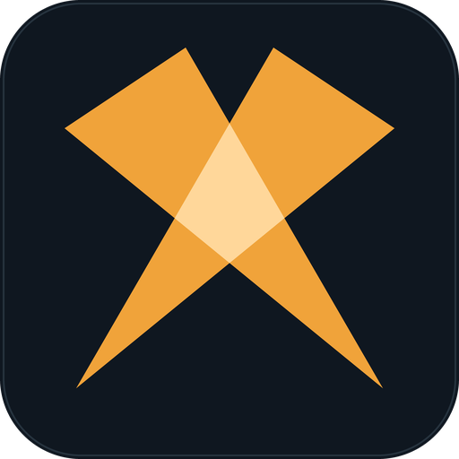

<div align="center">



# Strynex / O-CPS

**An open cooperative perception protocol for road vehicles. Strynex is what gets built on top of it.**

[](spec/)
[](ROADMAP.md)
[](spec/LICENSE)
[](LICENSE)

</div>

---

## What this is

A driver assistance system acts on what its own sensors can see. The cases that
kill people are the ones where that is not enough: the pedestrian stepping out
from behind a box truck, the stopped car past a blind crest, the motorcycle lost
in radar clutter, the wrong-way driver four seconds before anyone has line of
sight.

The radios that could carry the fix are already deployed. C-V2X PC5 and ITS-G5
move the bits, IEEE 1609.2 and the C-ITS PKI sign them, SAE J2735 and
ETSI TS 103 324 define what a vehicle broadcasts. What no deployed standard
settles is what two vehicles with different sensor suites, different vendors, and
different confidence in their own hardware should do with each other's
observations.

**O-CPS** (Open Cooperative Perception System) is that layer and nothing below
it. It defines no new radio layers, no new cryptographic primitives, and no new
market structures. It adds the three primitives the existing ecosystem leaves
underspecified:

1. **A normalized perception profile**, so vehicles with radically different
   sensor suites exchange a common world model.
2. **A fusion and trust framework**, so a receiver reaches calibrated confidence
   in a multi-source object track instead of averaging strangers.
3. **A C-ACC Group Protocol**, so driver-authorized platoons form, persist, hand
   off leadership, and dissolve with no cloud in the path.

**Strynex** is the reference implementation and the vehicle-facing brand for an
O-CPS stack. The two names are deliberately distinct. A vehicle may advertise
O-CPS conformance without implementing a single Strynex overlay, and the protocol
MUST continue to interoperate correctly.

## A standards and influence play, not a product

Quoting the abstract directly:

> O-CPS is a standards and influence play, not a product. It is published in the
> open, with a permissive license posture, to give automakers, suppliers,
> municipalities, and fleet operators a shared target to converge on rather than
> a vendor-specific lock-in.

That framing drives everything in this repository. The deliverable is a
specification other people can implement, a schema bundle they can compile
against, and a conformance suite they can be measured by. Adoption is the win
condition. The v1.0 milestone explicitly ends in **transfer of governance to an
established standards body**. This is not a codebase being groomed for a moat.

## Five layers open, one layer owned

The stack is §5.1 of the specification. Every layer from the radio up to the
message set is deliberately unowned, reuses standards that already exist, and is
licensed so that any automaker, supplier, or municipality can implement it
without asking permission. The application layer is the exception, and §1.2
already carves it out.

| Layer | What it carries | Posture |
| --- | --- | --- |
| **Application** | Cooperative behaviors. Strynex overlays live here. | **Trademark retained** |
| Perception & Fusion | Normalized profile, world model, trust weights | Open |
| Message | `PerceptionSummary`, `Intent`, `GroupState`, `Attestation`, `Telemetry` | Open |
| Security | IEEE 1609.2, ETSI TS 103 097, SCMS / C-ITS PKI, misbehavior detection | Open, reused |
| Transport / Network | BTP + GeoNetworking, PC5 sidelink | Open, reused |
| PHY / MAC | C-V2X PC5 (LTE-V2X / NR-V2X), ITS-G5 (802.11p/bd) | Open, reused |

**What the specification gives away.** The wire. Message formats, the perception
profile, the trust framework, the C-ACC Group Protocol, the conformance classes,
and the extension mechanism that lets anyone define overlays of their own. Free
to implement, royalty-free, patent-non-asserting, headed to an external standards
body at v1.0.

**What Strynex keeps.** The names and the mark. The overlay behaviors, the
trust-weighting implementation §6.5 leaves open, the reference implementation,
and the right to say a product is Strynex. Anyone may implement the profile.
Nobody else may use the name on the result.

**Why the split holds.** Every additional O-CPS implementation increases the
population a Strynex overlay can coordinate with, so giving away the substrate is
what makes the layer above it worth licensing. Wi-Fi Alliance, USB-IF, and
Bluetooth SIG all run this shape.

## Profiles are open. Overlays are branded.

Two things sit close together here and conflating them is the likeliest way to
read this repository wrong.

An **extension profile** is open, and it is a mechanism. It defines code points,
a payload encoding, and required behavior, so that implementations from different
vendors interoperate. Profiles in the Core range carry the specification's
CC BY 4.0 license and exist to be adopted, including by competitors.

A **Strynex overlay** is a product, and it is branded. It is one implementation
of one or more profiles, plus the parts the specification deliberately leaves
implementation-defined, plus a name that is a trademark.

So `EP-0003` Signal Timing Advisory is the open mechanism and Cadence is the
Strynex product that rides it. Anyone may implement EP-0003. Nobody else may call
the result Cadence. That is the entire commercial architecture, and it is why
publishing the profiles openly costs nothing.

## The catalog

Twenty-six overlays across four product lines, drawn by who signs the purchase
order rather than by technical similarity. An OEM, a city, a fleet, and a
certification program buy on different cycles, through different procurement,
against different budgets.

| Line | Buyer | Overlays |
| --- | --- | --- |
| **Strynex Drive** | OEM, tier-one supplier, aftermarket | 10 |
| **Strynex Civic** | City DOT, state DOT, transit authority, school district | 8 |
| **Strynex Fleet** | Carrier, logistics operator, transit fleet, insurer | 4 |
| **Strynex Assurance** | Everyone above, plus regulators | 4 |

Ten of the twenty-six need no code point allocation at all. They are products
built on v0.2 as written, or on the parts of it the specification leaves
implementation-defined, which is a stronger statement about the base message set
than any amount of new specification would be.

<details>
<summary><b>All 26 overlays, what each requires, and the conformance class it needs</b></summary>

<br>

`Base only` needs no new code points. `Base + payload` needs a telemetry payload
encoding that v0.2 left undefined. A profile identifier means code points are
reserved; **written** means the profile document exists, everything else is
allocated and unwritten. Classes are §16.1: **A** baseline, **B** full,
**I** infrastructure.

### Strynex Drive

| Overlay | What it does | Requires | Class |
| --- | --- | --- | --- |
| Slipstream | Driver-authorized platooning. Explicit group formation, synchronized gap targets, leader handoff. Every follower inherits the leader's forward horizon. | Base only | B |
| Cadence | Signal-tempo speed advisory. Coasting to a red instead of accelerating into it removes a whole stop-and-launch cycle from the fuel and brake budget. | `0x0003` | B |
| Parallax | See-through perception. An object hidden behind a box truck, rendered from a peer's viewpoint into your world model, trust-weighted and confidence-scored. | Base only | A |
| Sightline | Degraded-sensor continuity. Fog, whiteout, heavy spray, low sun into the camera array. The world model is held up on peers' sensors instead of collapsing. | `0x0010` | B |
| Interlace | Negotiated zipper merge. A lane drop resolved by agreed ordering rather than a race to the cone. | `0x0002` **written** | B |
| Breakwater | Stop-and-go wave absorption. A vehicle that opens a gap and absorbs the shockwave stops transmitting it to everyone behind. | `0x000C` | A |
| Wingman | Motorcycle conspicuity. Two-wheelers disappear into radar clutter and die in unprotected left turns. **Blocked by E-03.** | `0x0006` | A |
| Cairn | Positioning without satellites. Peers and RSUs at known poses become the reference frame in tunnels, urban canyons, and garages. | `0x0004` | B |
| Riptide | Wrong-way driver detection. Heading against MAP topology identifies it in one message, before anyone has line of sight. | `0x000B` | I |
| Flotsam | Debris and stopped-vehicle reporting. The ladder in lane two, the deer on the shoulder, the disabled car past a blind crest. | Base + payload | A |

### Strynex Civic

| Overlay | What it does | Requires | Class |
| --- | --- | --- | --- |
| Metronome | Demand-aware signal coordination. Phase timed against declared `Intent` from approaching vehicles rather than loops that see a car once it has already stopped. | `0x0003` | I |
| Clearway | Emergency vehicle preemption. Signals flip and traffic pre-diverts blocks ahead of the apparatus. **Needs a security design first.** | `0x0005` | I |
| Cordon | Responder scene protection. A moving protective envelope around crews working the shoulder. Move-over laws depend on a driver noticing; a cordon does not. | `0x000A` | B |
| Crossguard | School bus and school zone. The bus broadcasts `STOP` while the arm is out, and the advisory does not depend on seeing the flashing lights. | `0x0009` | B |
| Crossbuck | Grade crossing awareness. An RSU broadcasts train presence and gate state to approaching vehicles. | `0x0008` | I |
| Flagger | Work zone projection. Portable RSUs project the zone 400 m upstream, broadcast MAP deltas for shifted lanes, and carry workers on foot as high-confidence tracks. | `0x0007` | I |
| Braid | Network-scale pre-diversion. A corridor splits flow across parallel routes before the queue forms rather than after a navigation app notices it. | `0x000D` | I |
| Groundtruth | Road surface state as a data product. Friction, black ice, standing water, and pothole locations from wheel slip and ABS events across a fleet. | Base + payload | A |

### Strynex Fleet

| Overlay | What it does | Requires | Class |
| --- | --- | --- | --- |
| Slipstream Haul | Freight platooning tier, the §15.2 reference scenario. The specification declines to claim the fuel benefit; the commercial tier is allowed to quantify what the standard will not. | Base only | B |
| Dispatch | Fleet conformance and health console. Which units hold valid attestation, which sensors are drifting, which trucks would fail an audit tomorrow. | Base only | B |
| Marshal | Low-speed cooperative maneuvering. Yards, depots, loading docks, parking structures. Backing out of a blind bay on a peer's view of the aisle. | `0x000E` | A |
| Affidavit | Signed incident reconstruction from V-DIAG records. **Privacy review required before scoping.** | Base only | B |

### Strynex Assurance

| Overlay | What it does | Requires | Class |
| --- | --- | --- | --- |
| Assay | The trust engine. §6.5 mandates trust-weighted fusion and then states the weighting function is implementation-defined. Assay is how. | Base only | B |
| Veil | Privacy enforcement. Pseudonym rotation, butterfly-key unlinkability across epochs, retention limits, and the §16.3 prohibited-field scan extended to cover extension payloads. | Base only | A |
| Hallmark | Conformance certification and mark. Test against the reference suite, earn the badge. The revenue line that outlives the governance transfer, because the mark does not transfer with it. | Base only | n/a |
| Nightwatch | Cooperative stationary awareness. Parked vehicles as a sensing mesh. **Withheld, not allocated:** no conformant version exists. | Withheld | A |

One rule governs the names: each describes what the physical world does, never
what the software does. Physical names survive translation, do not date the way
technology words do, and cannot be diluted by a competitor shipping the same
feature under a generic term. There is no Smart, Auto, Pro, Plus, or Assist
anywhere in the catalog.

</details>

## The mechanism, and why the allocations exist now

All twenty-six were mapped against the message layer of §8 and **none of them
requires a sixth message class**. `PerceptionSummary`, `Intent`, `GroupState`,
`Attestation`, and `Telemetry` carry all of it.

What the other sixteen consume is enum code point space. §19 freezes the wire
format at v1.0 and §18.4 transfers governance at the same moment, so a range not
reserved before then cannot be reserved after without a new wire version, and the
decision moves to a committee. Reserving a range costs a line in a file today.
Recovering it later costs a standards cycle, or is simply impossible. So the
ranges are reserved now, the partitions are written, and
[`registry.yaml`](profiles/registry.yaml) is the machine-readable source of
truth.

| Extension point | Partition reserved | Allocated | Still free |
| --- | --- | --- | --- |
| `IntentCode` | 64–191 profile, 192–254 vendor, 255 sentinel | 9 blocks | 7 blocks |
| `TelemetryKind` | 32–127 profile, 128–254 vendor, 255 sentinel | 7 blocks | 5 blocks |
| Object class ID | `0x40`–`0xBF` profile, `0xC0`–`0xFE` vendor | 3 blocks | 26 blocks |
| Profile identifiers | `0x0001`–`0x00FF` core, `0x0100`–`0x0FFF` registered | 17 | 238 |
| Vendor blocks | `0x1000`–`0x7FFF`, blocks of 256 | 1 | 111 |
| New message classes | n/a | **0** | n/a |

**Safe ignore is what makes the mechanism publishable.** Every profile must be
safely ignorable: a receiver that discards all extension content and processes
only the base message is left in a correct and safe state. Two conformant
participants that share no profiles still exchange perception, intent, group
state, and telemetry correctly, so profiles can never fragment the population.

That was measured rather than asserted. An `Intent` carrying an unallocated code
round-trips byte-identically with every other field intact, because proto3 enums
are open. The wire layer gives safe ignore for free, and mapping an unrecognized
value to `UNKNOWN` is an application obligation rather than something the decoder
does, which is where the conformance suite has to look.

Seven prohibitions bound what a profile may do. It may not define a message
class, raise an ASIL allocation, lower a safety threshold, route around the §13.1
ADAS authority, extend retention past §10.3, require cloud connectivity in a
safety path, or make itself a prerequisite for base conformance. Those seven
lines are what make a privately administered vendor block safe to hand out.

## Where it breaks

Stated here rather than left to be discovered in review.

**E-03 is a critical defect in v0.2 and it is not adopted.** §15.4 promises that
vehicles fuse pedestrian and cyclist beacons "as flagged vulnerable tracks,
weighted appropriately." Four clauses then combine to forbid acting on them:

```text
w = w_cert x w_attest x w_history x w_conf
  = 1.0   x 0.5      x 1.0       x 0.498
  = 0.249   against an advisory threshold of 0.5
```

Class A gets 0.5 for an attestation it cannot transmit, §15.4 specifies LOW to
MEDIUM confidence, and §7.3 caps MEDIUM at 127 of 255. The product falls below
the §11.4 threshold, so a conformant receiver may display a pedestrian beacon and
may do nothing else with it. The failure is inverted with respect to risk: where
the vehicle already sees the pedestrian its own track clears the threshold and
the beacon adds nothing, and where the pedestrian is occluded, the only case
where the beacon carries information the vehicle lacks, the beacon is the sole
contributor and is muted. A narrow bounded exception is drafted in
[`docs/errata-v0.2.md`](docs/errata-v0.2.md#e-03) and needs a functional-safety
reviewer.

Seven further defects are recorded there with quoted evidence, the consequence,
and drop-in replacement text. One critical, six major, one minor. None is
adopted.

Three overlays need a decision before they need engineering, and all three are
recorded in the registry with the reason attached:

- **Nightwatch** has no conformant version. §10.3 caps `PerceptionSummary`
  retention at 60 seconds with no exception and §10.5 prohibits constructing
  long-term movement traces, and a parking-lot product is only useful if it
  remembers. It is deliberately withheld rather than allocated so nobody builds
  against a code point that implies it is coming.
- **Affidavit** replays what peers transmitted, which retains others'
  `PerceptionSummary` well past 60 seconds. A version limited to the vehicle's
  own perception and its own advisory outputs is defensible. The line has to be
  drawn before anyone scopes it, not during a discovery request.
- **Clearway** is a trust problem rather than a privacy one. A priority claim any
  participant can assert is a corridor denial-of-service primitive, and the
  authorization model has to bind to enrollment credentials, which is precisely
  the linkage §10.5 restricts.

## Current status

- **v0.2: published.** The full draft specification, dated April 2026, is in
  [`spec/`](spec/), converted verbatim from the source document in
  [`reference/`](reference/).
- **v0.3: open, not started.** None of its three deliverables is complete: the
  machine-readable schemas ([#1](https://github.com/Locke-Werks/Strynex/issues/1)),
  the Python test harness ([#2](https://github.com/Locke-Werks/Strynex/issues/2)),
  and the adversarial PCAP corpus
  ([#3](https://github.com/Locke-Werks/Strynex/issues/3)). Target Q3 2026. See
  [`ROADMAP.md`](ROADMAP.md).

The protobuf under [`schemas/`](schemas/) is a first extraction of Appendix A
into compiling files. It is not yet the finished v0.3 schema deliverable.

Prerequisite work for v0.3 has landed and is not itself a deliverable:
[`docs/errata-v0.2.md`](docs/errata-v0.2.md) records the eight defects,
[`profiles/`](profiles/) supplies the extension mechanism §6.6 permits and never
defines, and [`schemas/proposed/v0.3/`](schemas/proposed/v0.3/) holds the
additive schema changes those two imply, including encodings for
`Telemetry.payload`, which v0.2 leaves undefined for all four `TelemetryKind`
values and which the PCAP corpus cannot be recorded without.

Two further things are undecided, both tracked as errata. §16.2 defines the
reference implementation as four components including a C reference codec that
appears in no milestone, and §16.3's first conformance category needs it. And
§14.3 applies the ISO 26262 lifecycle with no scoping by conformance class, which
puts ASIL C on the cheapest class in the specification.

**Nothing in `profiles/` or `schemas/proposed/` amends the v0.2 text.** All of it
is proposed and needs an owner decision before adoption.

## Repository layout

```
spec/                  The v0.2 specification, split per section
  README.md            Section index and conversion notes
  00-abstract.md ...   Per-section files, numbered in reading order
  OCPS_v0.2_full.md    Unsplit conversion, authoritative if the split disagrees
  LICENSE              CC BY 4.0, applies to spec/ and reference/
reference/             Source documents, verbatim
  OCPS_Whitepaper_v0.2.docx
  OCPS_Whitepaper_v0.2.pdf
schemas/proto/ocps/v2/ Normative protobuf from Appendix A, package ocps.v2
  common.proto         OcpsHeader, Pose, Dimensions          (A.1)
  perception.proto     PerceivedObject, PerceptionSummary    (A.2)
  intent.proto         IntentCode, Intent                    (A.3)
  group.proto          GroupMode, GroupState                 (A.4)
  attestation.proto    SensorHealth, Attestation             (A.5)
  telemetry.proto      TelemetryKind, Telemetry              (A.6)
schemas/proposed/v0.3/ Proposed v0.3 schema additions. NOT normative.
  README.md            What is proposed, the diffs against v2, and verification
  proto/ocps/v2/       ExtensionBlock, ConformanceDeclaration, Telemetry payloads
profiles/              Extension profile registry and profile specifications
  EP-0000-...md        The framework: ID ranges, code points, safe-ignore rules
  README.md            Registry, overlay map, and all code point allocations
  registry.yaml        Machine-readable allocations. Source of truth.
  EP-0001-...md        Intersection Assist, owed by §12.3 and roadmap v0.4
  EP-0002-...md        Merge Negotiation, closes a v0.2 gap around IntentCode MERGE
tests/                 Conformance suite scaffolding, stubs only, nothing passes
  README.md            What each of the seven suites must cover
site/                  The overlay catalog as a standalone page, no build step
docs/
  conversion-notes.md  How spec/ was produced, verified, and what was left uncorrected
  errata-v0.2.md       Eight verified v0.2 defects with proposed replacement text
  open-questions.md    Undecided questions. Not decisions.
ROADMAP.md             v0.3 through v1.0
LICENSE                Apache 2.0, applies to everything outside spec/ and reference/
```

## Licensing

The repository is deliberately split, matching §18 of the specification:

| Path | License | SPDX |
| --- | --- | --- |
| `spec/`, `reference/` | Creative Commons Attribution 4.0 International | `CC-BY-4.0` |
| Everything else (`schemas/`, `tests/`, reference implementation) | Apache License 2.0 | `Apache-2.0` |

The reasoning is the standard one for a specification that wants to be adopted.
The **document** is CC BY 4.0 so anyone can quote it, translate it, excerpt it
into their own standards work, or fold it into a national profile, as long as
they say where it came from. The **code and schemas** are Apache 2.0 because
implementers need an explicit patent grant and a warranty disclaimer that a
content license does not provide.

The full Apache 2.0 text is at [`LICENSE`](LICENSE); the full CC BY 4.0 text is
at [`spec/LICENSE`](spec/LICENSE).

Per §18.3, no patent claims are asserted against good-faith implementers.
"Strynex" and the overlay names are trademarks of Specter Point Intelligence, LLC
and are licensed by neither of the above. O-CPS conformance claims do not require
or imply permission to use them.

Copyright © 2026 Archon C. Locke, Specter Point Intelligence, LLC.
Colorado Springs, Colorado, USA.

## Working on this repository

The whitepaper in `reference/` is the source of truth. Two rules follow:

1. **Do not edit `spec/` to change the specification.** Those files are a
   mechanical conversion of the source document. Edit the source and re-convert,
   or the two drift apart silently.
2. **Where the spec is silent, mark a `TODO(spec)`.** Do not invent requirements,
   threat mitigations, tolerances, or conformance criteria to fill a gap. An
   explicit hole is a v0.3 agenda item; a quietly invented requirement is a bug
   that ships.
